# ER図(エンティティ関係図)

GGH ライフポイント管理アプリのデータベース構造です。
実装は [`prisma/schema.prisma`](../prisma/schema.prisma) を参照してください。

```mermaid
erDiagram
    users ||--o{ point_logs : "獲得・消費"
    users ||--o{ user_achievements : "解除"
    users ||--o{ user_missions : "挑戦"
    users ||--o{ reward_exchanges : "交換"
    users ||--o{ notifications : "受信"
    users ||--o{ support_records : "対象"
    users ||--o{ staff_comments : "対象"

    point_actions ||--o{ point_logs : "元になる行動"
    point_actions ||--o{ mission_templates : "進捗連動"

    achievements ||--o{ user_achievements : "定義"
    mission_templates ||--o{ user_missions : "生成"
    reward_items ||--o{ reward_exchanges : "対象商品"

    users {
        uuid id PK "Supabase Auth UID"
        string email UK
        string name
        string avatar_url
        enum role "USER / STAFF / ADMIN"
        int current_lp "所持LP(交換で減る)"
        int total_earned_lp "累計LP(レベル計算用)"
        boolean show_in_ranking "ランキング表示ON/OFF"
        boolean is_active
    }

    point_actions {
        string id PK
        string name "起床・服薬など"
        int points
        string icon
        string category
        boolean is_active
    }

    point_logs {
        string id PK
        uuid user_id FK
        string action_id FK "nullable"
        string action_name "スナップショット"
        int points "正=獲得 負=消費"
        uuid granted_by_id FK "チェックしたスタッフ"
        datetime created_at
    }

    achievements {
        string id PK
        string code UK "FIRST_LOGIN など"
        string name
        string description
        int bonus_lp
        boolean is_secret "隠し実績"
    }

    user_achievements {
        string id PK
        uuid user_id FK
        string achievement_id FK
        datetime unlocked_at
    }

    mission_templates {
        string id PK
        string title
        enum type "DAILY / WEEKLY"
        int target_count
        int reward_lp
        string action_id FK "nullable 自動進捗用"
    }

    user_missions {
        string id PK
        uuid user_id FK
        string template_id FK
        enum type
        date period_start "日 or 週の月曜"
        int progress
        boolean completed
    }

    reward_items {
        string id PK
        string name
        int cost_lp
        int stock "null=無制限"
        boolean is_active
    }

    reward_exchanges {
        string id PK
        uuid user_id FK
        string item_id FK
        string item_name "スナップショット"
        int cost_lp
        enum status "PENDING/APPROVED/DELIVERED/CANCELED"
    }

    notifications {
        string id PK
        uuid user_id FK
        enum type "POINT/LEVEL_UP/MISSION..."
        string title
        boolean is_read
    }

    support_records {
        string id PK
        uuid user_id FK "対象利用者"
        uuid staff_id FK "記入スタッフ"
        string content
        datetime recorded_at
    }

    staff_comments {
        string id PK
        uuid user_id FK
        uuid staff_id FK
        string body
    }

    announcements {
        string id PK
        string title
        string body
        boolean is_published
    }

    events {
        string id PK
        string title
        datetime starts_at
        datetime ends_at
        string location
    }

    app_settings {
        string key PK "ranking_enabled など"
        string value
    }
```

## 設計のポイント

| 設計 | 理由 |
|---|---|
| `current_lp` と `total_earned_lp` を分離 | 景品交換でポイントを使ってもレベルが下がらないようにするため |
| `point_logs.action_name` をスナップショット保存 | 管理者が行動マスタを変更・削除しても過去の履歴が変わらないようにするため |
| `reward_exchanges.item_name` も同様 | 商品マスタの変更に履歴が影響されないため |
| マスタ削除は `is_active = false`(論理削除) | 履歴からの参照を守るため |
| `user_missions` に `(user, template, period_start)` の複合ユニーク | ミッションの二重生成を防ぐため |
| ミッションは表示時に遅延生成 | cron 不要で「毎日自動生成」を実現(Vercel Cron への移行も容易) |
